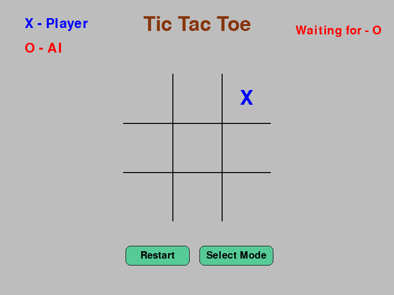

# Tic Tac Toe With AI
## Getting Started
#### **Download the Zip File**, and extract it anywhere. After extracting place all files in a single folder and open game.pyw. 
## Description Of Game
<ul>
  <li>This is a good old game Of Tic Tac Toe</li>
  <li>It is Made in python with the help of pygame Library.</li>
</ul>

## Features 
<ol>
  <li><b>Game has multiple states like Starting Screen and then actual game.</b></li>
  <li>Smart AI, it will try its best to defeat you at the same time trying to win.</li>
  <li><b>Clean code using classes/oop</b>.</li>
  <li><b>Used Numpy Library to make AI to have slightly more performance</b></li>
</ol>

### Note:-
## This AI is almost unbeatable but if you are lucky enough there is a way it can loose can you find it ? :wink:

### Demo

# Finally Thank You! For trying my game. :innocent:
